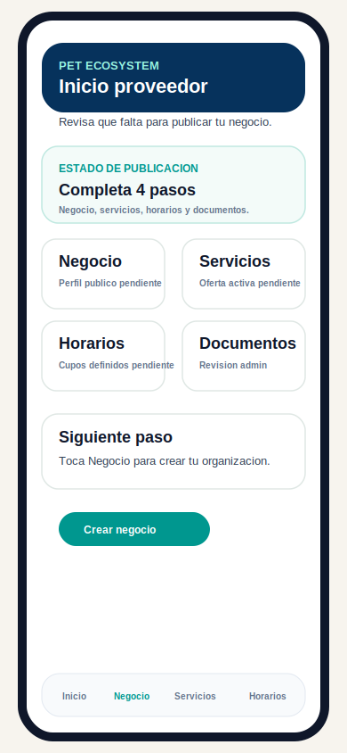
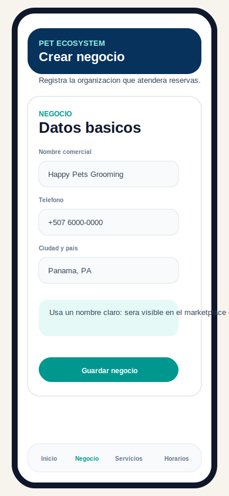
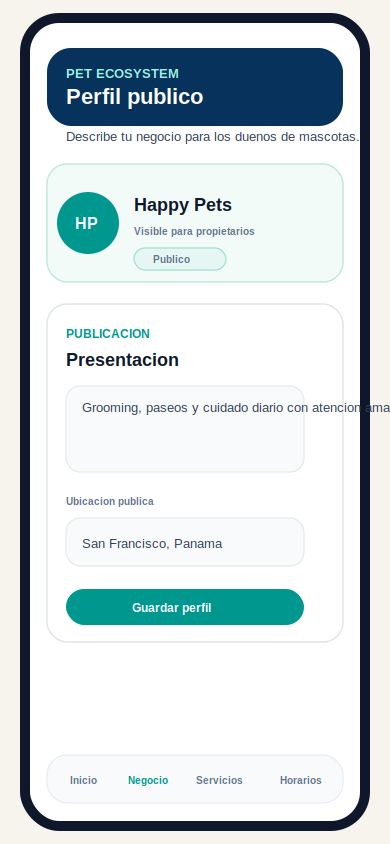
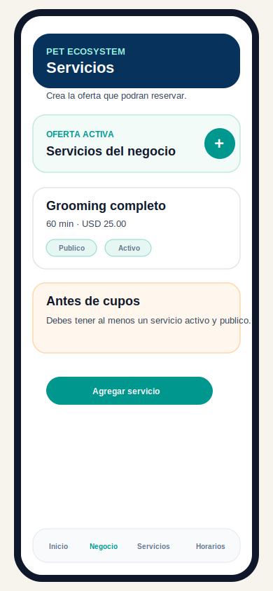
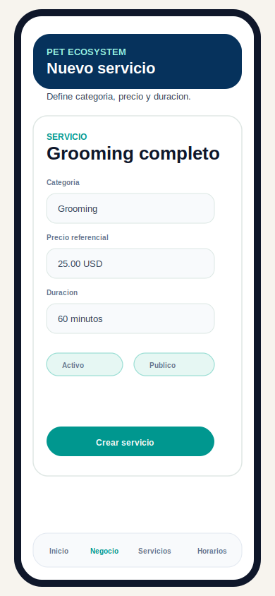
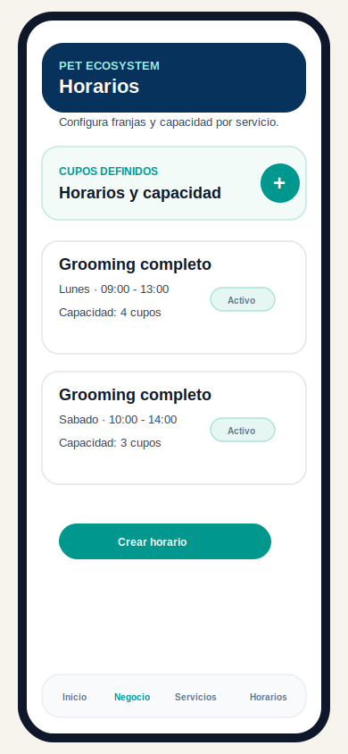
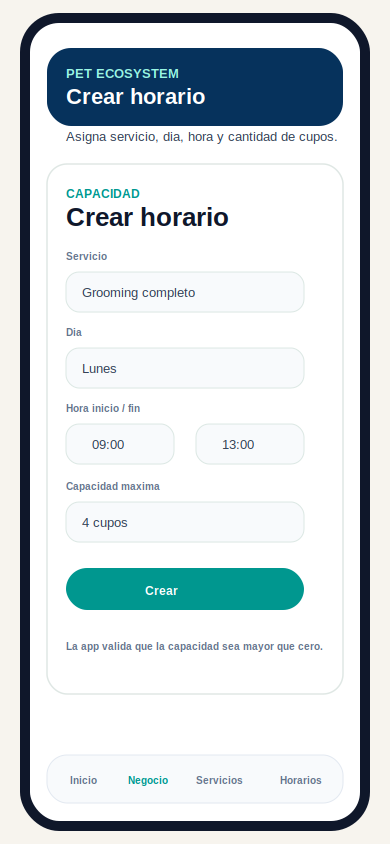
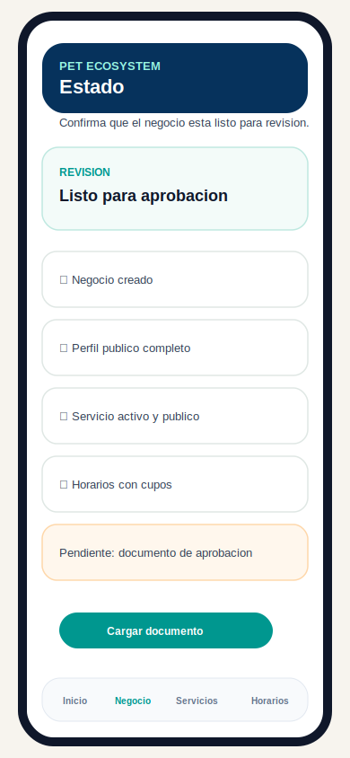

# Manual de usuario: crear negocio, servicios y cupos

## Objetivo

Guiar al proveedor piloto para registrar un negocio en Pet Ecosystem, completar su perfil publico, crear servicios y definir horarios con cupos disponibles.

Este manual usa el flujo actual de la app para proveedor. Durante el piloto no hay cobros reales; los precios son referenciales y el negocio queda sujeto a aprobacion administrativa antes de aparecer plenamente en marketplace.

## Antes de empezar

Necesitas:

- Tener instalada la APK privada del piloto.
- Haber creado una cuenta con rol `Proveedor`.
- Haber iniciado sesion.
- Tener a mano la informacion basica del negocio: nombre comercial, telefono, ciudad, pais, descripcion, servicios, precios, duracion y horarios.

Si tu cuenta tiene mas de un rol, entra en modo proveedor antes de configurar el negocio.

## Flujo completo

El flujo recomendado es:

1. Revisar el inicio del proveedor.
2. Crear el negocio.
3. Completar el perfil publico y ubicacion.
4. Crear servicios.
5. Activar y publicar servicios.
6. Crear horarios y cupos.
7. Revisar estado de publicacion.
8. Cargar documentos y esperar aprobacion.

No intentes crear cupos antes de crear al menos un servicio activo. La capacidad siempre se asigna a un servicio.

## 1. Inicio proveedor



Al entrar como proveedor, la pantalla de inicio muestra el estado general del negocio y los pasos pendientes para estar listo.

Revisa las tarjetas:

- `Negocio`: datos basicos y perfil publico.
- `Servicios`: oferta que podran reservar los propietarios.
- `Horarios`: franjas disponibles y cupos.
- `Documentos`: archivos necesarios para revision administrativa.

Toca `Negocio` o `Crear negocio` para iniciar.

## 2. Crear negocio



En la seccion `Negocio`, completa los datos basicos de la organizacion.

Campos principales:

- `Nombre comercial`: nombre visible internamente y usado como base para tu presencia publica.
- `Telefono`: numero de contacto operativo.
- `Ciudad y pais`: ubicacion general del negocio.

Buenas practicas:

- Usa un nombre claro y reconocible.
- Evita abreviaturas internas que el propietario no entienda.
- Verifica telefono y ciudad antes de guardar.

Cuando termines, toca `Guardar negocio`.

Resultado esperado:

- El negocio queda creado.
- La app habilita las secciones de perfil publico, servicios, horarios y documentos para ese negocio.

## 3. Completar perfil publico



El perfil publico explica al propietario que ofrece tu negocio. Es la informacion que ayuda a decidir si reservar contigo.

Completa:

- Nombre visible.
- Presentacion o descripcion corta.
- Foto, logo o avatar si esta disponible.
- Ciudad o zona publica.
- Estado publico cuando corresponda.

Recomendacion de descripcion:

```text
Grooming, paseos y cuidado diario con atencion amable para mascotas pequenas y medianas.
```

Ubicacion:

- Publica solo la ubicacion que quieres mostrar en marketplace.
- No uses direcciones privadas de clientes.
- Si la app ofrece coordenadas aproximadas por ciudad, puedes usarlas sin activar GPS.

Guarda los cambios antes de continuar.

## 4. Crear servicios



Entra a `Servicios`. Esta seccion contiene la oferta que los propietarios podran consultar y reservar.

Para crear un servicio:

1. Toca el boton `+` o `Agregar servicio`.
2. Completa el formulario.
3. Marca el servicio como activo.
4. Marca el servicio como publico si debe aparecer en marketplace.
5. Guarda.

Cada servicio debe representar algo que realmente puedes atender, por ejemplo:

- Grooming completo.
- Paseo de 30 minutos.
- Guarderia por dia.
- Consulta veterinaria inicial.

## 5. Completar formulario de servicio



Campos principales:

- `Servicio`: nombre claro de la oferta.
- `Categoria`: tipo de servicio, como grooming, paseos, guarderia o veterinaria.
- `Precio referencial`: monto mostrado para orientar al propietario.
- `Duracion`: tiempo estimado para ejecutar el servicio.
- `Activo`: indica que el servicio puede operar.
- `Publico`: indica que puede mostrarse en marketplace cuando el negocio este aprobado.

Reglas importantes:

- Un servicio inactivo no debe ofrecerse para reservas.
- Un servicio no publico puede existir internamente, pero no debe mostrarse al propietario.
- El precio no ejecuta cobro real durante el piloto.

Toca `Crear servicio` o `Guardar` al terminar.

## 6. Crear horarios y cupos



Entra a `Horarios` en mobile o a `Agenda` en la web de proveedor. Aqui defines en que dias y horas atiendes cada servicio y cuantos cupos puedes aceptar.

Una regla de horario responde:

- Que servicio se atiende.
- Que dia de la semana.
- Desde que hora.
- Hasta que hora.
- Cuantos cupos maximos hay.
- Si el horario esta activo.

Ejemplo:

```text
Servicio: Grooming completo
Dia: Lunes
Horario: 09:00 - 13:00
Capacidad: 4 cupos
Estado: Activo
```

Esto significa que el negocio puede recibir hasta 4 reservas para ese servicio en esa franja, sujeto a las reglas de disponibilidad del sistema.

## 7. Completar formulario de cupo



Para crear una franja:

1. Toca `+`, `+ Horario` o `Crear horario`.
2. Selecciona el servicio.
3. Selecciona el dia.
4. Define hora de inicio.
5. Define hora de fin.
6. Escribe la capacidad maxima.
7. Deja el horario activo si debe estar disponible.
8. Toca `Crear`.

Validaciones esperadas:

- La capacidad debe ser mayor que cero.
- La hora final debe ser posterior a la hora inicial.
- Debe existir al menos un servicio para poder crear horarios.

Buenas practicas:

- Crea horarios realistas segun tu operacion.
- No publiques mas cupos de los que puedes atender.
- Si vas a atender varios servicios, crea cupos separados por servicio.
- Revisa los horarios despues de guardarlos para confirmar que quedaron activos.

## 8. Revisar estado de publicacion



Entra a `Estado` para confirmar si el negocio esta listo para revision.

Checklist esperado:

- Negocio creado.
- Perfil publico completo.
- Al menos un servicio activo y publico.
- Horarios con cupos definidos.
- Documentos de aprobacion cargados cuando apliquen.

Si falta un paso, toca la tarjeta correspondiente y completa la informacion.

Cuando todo este listo, el administrador podra revisar el negocio. Solo los negocios aprobados y publicos deben aparecer plenamente en marketplace.

## Que ve el propietario despues

Cuando el negocio esta aprobado y publicado, el propietario puede encontrarlo en `Buscar`, revisar sus servicios y seleccionar horarios disponibles.

La disponibilidad que ve el propietario depende de:

- Negocio aprobado.
- Negocio publico.
- Perfil publico activo.
- Servicio activo y publico.
- Horarios activos con cupos.
- Capacidad disponible para la fecha y franja.

## Errores comunes

### No puedo crear horarios

Posibles causas:

- Todavia no creaste servicios.
- El servicio esta inactivo.
- La hora final es menor o igual que la hora inicial.
- La capacidad esta en cero.

### Mi negocio no aparece publicado

Revisa:

- Perfil publico completo.
- Servicio publico y activo.
- Horarios activos.
- Documentos cargados.
- Aprobacion del admin.

### El servicio aparece, pero no hay cupos

Revisa:

- Que exista una regla de horario para ese servicio.
- Que la regla este activa.
- Que el dia y la hora sean correctos.
- Que la capacidad sea mayor que cero.

## Checklist final para proveedor

Antes de avisar que tu negocio esta listo, confirma:

- [ ] Puedo entrar como proveedor.
- [ ] El negocio existe.
- [ ] El perfil publico tiene descripcion clara.
- [ ] La ubicacion publica es correcta.
- [ ] Tengo al menos un servicio activo.
- [ ] El servicio esta marcado como publico.
- [ ] Tengo al menos un horario activo.
- [ ] El horario tiene capacidad mayor que cero.
- [ ] Subi los documentos solicitados.
- [ ] Revise el estado de aprobacion.

## Soporte

Si algo falla, envia al equipo piloto:

- Captura de pantalla.
- Paso exacto donde ocurrio.
- Email de tu cuenta.
- Nombre del negocio.
- Modelo del telefono y version Android si aplica.

Ejemplo:

```text
Soy proveedor piloto. Estaba creando un horario para Grooming completo.
El error ocurre al tocar Crear. Mi negocio es Happy Pets Grooming.
Adjunto captura.
```
